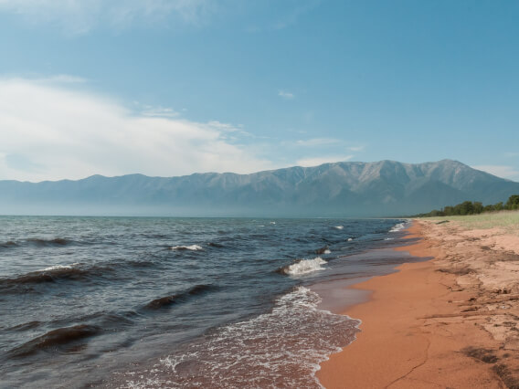

# Путешествие по России :evergreen_tree:
## Адаптивный одностраничный сайт о достопримечательностях России

### Сайт подстраивается под разрешения больших мониторов, ноутбуков, планшетов и смартфонов.
----------------
### Используемые технологии и ПО :rocket::
* ### HTML
* ### CSS
  * ### Grid
  * ### Flex
* ### BEM Nested
* ### VS Code
* ### Git
  * ### Github
----------------
:information_source:
### [https://azmorigan.github.io/russian-travel/](https://azmorigan.github.io/russian-travel/)
### [Проект на Github](https://github.com/azmorigan/russian-travel) 
### [Макет](https://www.figma.com/file/PbwYExmLQBMZEaFYUvlx89/Sprint-3-Russia-desktop-mobile-Copy)